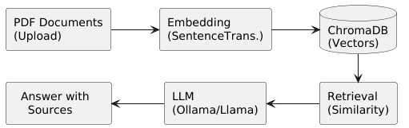
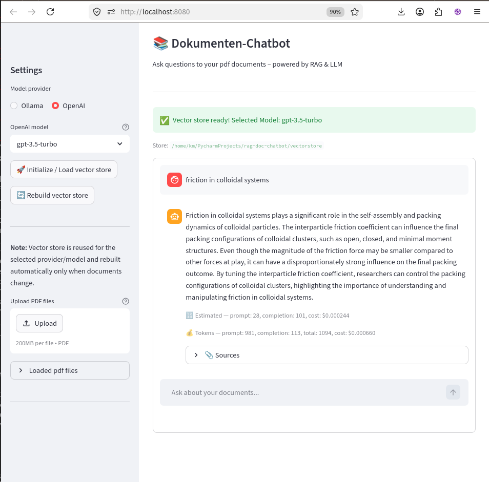

# 📚 Document Chatbot with RAG

## Project Overview

An intelligent chatbot that answers questions about PDF documents – based on **Retrieval-Augmented Generation (RAG)**. The system extracts knowledge from uploaded documents and delivers precise answers with source citations.
Initial vector store creation can take several minutes depending on document size. To improve user experience, this application saves the computed vector store to disk together with its embedding model configuration and document structure. 
Subsequent application launches load the persisted vector store instantly, eliminating the need for recomputation.
## What It Does

- 📄 **Process PDF Documents** – Loads and analyzes arbitrary PDF files
- 🔍 **Intelligent Search** – Finds relevant text passages using vector embeddings
- 💬 **Natural Answers** – An LLM generates understandable responses based on the documents
- 📎 **Source Citations** – Every answer shows which document the information comes from
- 💾 **Persistent Storage** – Once-processed documents are cached for fast follow-up queries
- 💰 **Cost Estimation Before Sending** – For OpenAI queries, estimated token usage and cost (lib: tokencost) are shown before the request is sent

## Technology Stack

| Component | Technology | Purpose |
|-----------|------------|---------|
| **Frontend** | Streamlit | Interactive chat interface |
| **RAG Framework** | LangChain | Orchestration of the RAG pipeline |
| **Embeddings** | SentenceTransformers | Text-to-vector conversion (local) |
| **Vector Database** | ChromaDB | Storage & similarity search |
| **LLM** | Ollama (Llama 3.2) | Answer generation (local) |
| **PDF Processing** | PyPDF | Document extraction |

## Architecture



## Key Features

✅ **Local Execution** – No data leaves the local machine (privacy-friendly)
✅ **Source Transparency** – Every answer is traceably sourced
✅ **Extensible** – Easy integration of additional document formats (.txt, .md, .docx)
✅ **Production-Ready Patterns** – Clean code, modular architecture, environment configuration

## Use Cases

- 📖 **Knowledge Bases** – Company handbooks, documentation, wikis
- 🎓 **Research** – Making scientific papers searchable
- 📋 **Compliance** – Quickly querying policies and contracts
- 🏥 **Medical/Legal** – Domain-specific documents with source requirements

## What I Learned

- **RAG Architecture** – How to extend LLMs with external knowledge
- **Vector Embeddings** – Semantic search instead of keyword matching
- **LangChain Framework** – Production patterns for LLM applications
- **Local LLMs** – Ollama, model selection, performance optimization
- **End-to-End Development** – From idea to deployable system

## Installation & Usage

add `.env` file with the following content:
```
# OPENAI_API_KEY=
# ODER wenn du Ollama lokal nutzt:
OLLAMA_BASE_URL=http://localhost:11434
```

```bash
# Clone
git clone https://github.com/kia/rag-doc-chatbot.git
cd rag-doc-chatbot

# Virtual environment
python3 -m venv venv
source venv/bin/activate  # Linux/Mac
# Or on Windows: venv\Scripts\activate

# Dependencies
pip install -r requirements.txt

# Start Ollama (for local LLM)
ollama serve

# Pull the recommended fast model
ollama pull llama3.2:1b

# Or if you want to use llama3.1 (larger, slower):
ollama pull llama3.1:8b
```
add pdf documents to the `documents` directory
```
# Start app
streamlit run app.py
```

## Demo



---

## 🎯 This project demonstrates hands-on experience with **core concepts of modern LLM development**:

| Skill | Demonstrated in Project |
|-------|------------------------|
| **RAG Pipelines** | Complete implementation from retrieval to generation |
| **Embeddings** | Understanding of semantic vector search |
| **LLM Integration** | Ollama/OpenAI connection, prompt context |
| **Vector Databases** | ChromaDB for similarity search |
| **Production Thinking** | Caching, persistence, environment configuration |
| **Data Privacy** | Local execution, no cloud dependency |

---

## Possible Extensions (Roadmap)

- [ ] Multi-user support with authentication
- [ ] More file formats (.docx, .txt, .md)
- [ ] Chat history in database (H2/PostgreSQL)
- [ ] FastAPI backend instead of Streamlit
- [ ] Docker container for easy deployment
- [ ] Evaluation metrics for answer quality

---
